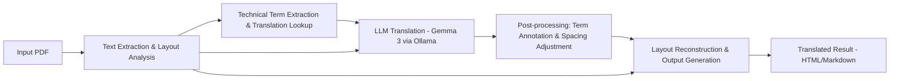

# PDF Translator

A PDF translation system that preserves layout while translating documents up to 50 pages using local LLMs (Gemma 3 via Ollama) or OpenAI API.

## Features

- **Layout Preservation**: Maintains original document structure, page breaks, and formatting
- **Local LLM Support**: Uses Gemma 3 via Ollama for privacy and cost-effectiveness
- **OCR Capability**: Handles both text and image PDFs with PaddleOCR
- **Technical Term Mining**: Automatically extracts and provides translations for technical terms
- **Multiple Output Formats**: Generates HTML or Markdown with preserved layout
- **Term Annotation**: Shows technical terms as "訳語（原語）" on first occurrence
- **Free & Open Source**: Prioritizes free tools with OpenAI as optional fallback

## Architecture



## Requirements

- Python 3.11+
- UV package manager (recommended) or pip
- Ollama (for local LLM) or OpenAI API key

## Installation

### Using UV (Recommended)

```bash
# Install dependencies
make install          # Production dependencies only
make dev-install      # All dependencies including dev tools
```

### Manual Installation

```bash
# Clone the repository
git clone <repository-url>
cd pdf-translator

# Install dependencies
pip install -e .
```

## Setup

### 1. Install Ollama and Models

```bash
# Start Ollama server and install Gemma 3
make run-ollama       # Starts server and ensures gemma3:12b is available

# Or manually:
ollama serve
ollama pull gemma3:12b
```

### 2. Configuration

The system supports three configuration methods (in priority order):

#### 2.1 Environment Variables (.env file)

Create a `.env` file for local settings (not committed to git):

```bash
# .env file (optional, for local settings)
OLLAMA_API_URL=http://localhost:11434/api
OLLAMA_MODEL=gemma3:12b
OLLAMA_TIMEOUT=120
OPENAI_API_KEY=your-api-key-here
```

#### 2.2 Configuration File

The main configuration file `config/config.yml`:

```yaml
translator:
  engine: ollama              # ollama / openai
  model: gemma3:12b          # Ollama model name
  openai_model: gpt-3.5-turbo # For engine=openai
  base_url: "http://localhost:11434/api"  # Ollama API endpoint
  temperature: 0.3
  max_tokens: 4096

source_language: auto
target_language: ja
preserve_format: true
include_source_term: true

output_format: markdown   # markdown / html
max_pages: 50
layout_analysis: true
term_extraction:
  enabled: true
  min_frequency: 2
  max_terms: 100
```

#### 2.3 Command Line Arguments

Override any setting via command line:

```bash
python main.py input.pdf --engine openai --format html --pages 1-10
```

### 3. Remote Ollama Server (Optional)

For better performance, you can use a remote Ollama server:

```bash
# .env file
OLLAMA_API_URL=http://your-server:11434/api
OLLAMA_MODEL=gemma3:12b
OLLAMA_TIMEOUT=120
```

### 4. For OpenAI API (Optional)

Set your API key in `.env` file or environment variable:

```bash
# In .env file
OPENAI_API_KEY="your-api-key-here"

# Or as environment variable
export OPENAI_API_KEY="your-api-key-here"
```

## Usage

### Command Line

```bash
# Basic usage
python main.py input.pdf

# Specify output format
python main.py input.pdf --format html

# Use OpenAI instead of local LLM
python main.py input.pdf --engine openai

# Custom output path
python main.py input.pdf --output translated.md

# Process specific pages only
python main.py input.pdf --pages 1-5

# Analyze PDF without translation (dry run)
python main.py input.pdf --dry-run

# Disable specific features
python main.py input.pdf --no-terms --no-layout

# Verbose logging
python main.py input.pdf -v

# Quiet mode (errors only)
python main.py input.pdf -q

# Force OCR for text PDFs
python main.py input.pdf --ocr

# Disable OCR completely
python main.py input.pdf --no-ocr

# Specify languages
python main.py input.pdf --source-lang en --target-lang ja

# Use custom configuration file
python main.py input.pdf -c my-config.yml
```

### Available Command Line Options

```
positional arguments:
  input                 Input PDF file path

options:
  -h, --help            show this help message and exit
  -o OUTPUT, --output OUTPUT
                        Output file path (default: auto-generated)
  -c CONFIG, --config CONFIG
                        Configuration file path (default: config/config.yml)
  --engine {ollama,openai}
                        Translation engine to use
  --model MODEL         Model name for translation
  --format {html,markdown}
                        Output format
  --source-lang SOURCE_LANG
                        Source language code (default: auto-detect)
  --target-lang TARGET_LANG
                        Target language code (default: ja)
  --pages PAGES         Page range (e.g., '1-10', '1,3,5-7')
  --ocr                 Force OCR processing
  --no-ocr              Disable OCR processing
  --no-terms            Disable technical term extraction
  --no-layout           Disable layout analysis
  -v, --verbose         Enable verbose logging
  -q, --quiet           Suppress all output except errors
  --dry-run             Analyze PDF without translation
  --version             Show version number
```

### Python API

```python
from pdf_translator.config.manager import ConfigManager
from pdf_translator.core.pipeline import TranslationPipeline

# Create configuration
config = ConfigManager()

# Create pipeline
pipeline = TranslationPipeline(config)

# Analyze PDF (dry run)
analysis = pipeline.analyze("input.pdf")
print(f"Pages: {analysis['total_pages']}, Characters: {analysis['total_chars']}")

# Translate PDF
result = pipeline.translate("input.pdf", "output.html")
print(f"Translation completed in {result['processing_time']:.1f}s")
```

## Module Overview

| Module | Purpose | Key Libraries | Status |
|--------|---------|---------------|--------|
| **extractor** | PDF text extraction & OCR | PyMuPDF, PaddleOCR | ✅ Complete |
| **layout_analyzer** | Layout detection for columns, tables, figures | LayoutLM, DiT | ✅ Complete |
| **term_miner** | Technical term extraction & translation lookup | spaCy, Wikipedia API | ✅ Complete |
| **translator** | LLM integration for translation | Ollama/OpenAI | ✅ Complete |
| **post_processor** | Source term annotation & spacing adjustment | Python (regex) | ✅ Complete |
| **renderer** | HTML/Markdown output generation | Jinja2, Markdown-it-py | ✅ Complete |
| **core.pipeline** | Main integration pipeline | - | ✅ Complete |
| **config.manager** | Unified configuration management | python-dotenv, PyYAML | ✅ Complete |

## Development

### Setup Development Environment

```bash
make dev-install      # Install all dependencies including dev tools
```

### Running Tests

```bash
make test             # Run all tests
make test-translate   # Quick test with sample PDF

# Or manually with UV
./run-uv.sh run pytest tests/

# Test individual components
./run-uv.sh run python test_simple_pipeline.py

# Test main CLI
python main.py tests/fixtures/sample_english.pdf --dry-run
```

### Code Quality

```bash
make lint             # Run linting with ruff
make format           # Format code with ruff  
make type-check       # Type checking with mypy
make check            # Run all checks (lint, type-check, test)
```

### Environment Verification

```bash
# Verify all components work correctly
./run-uv.sh run python test_setup.py
```

## Current Status & Limitations

### ✅ Working Features
- PDF text extraction (PyMuPDF) and OCR (PaddleOCR)
- Layout analysis with fallback mode
- Technical term extraction and Wikipedia lookup
- Ollama/OpenAI translation integration
- Post-processing with term annotation
- HTML/Markdown output generation
- Comprehensive CLI with all options
- Configuration management with .env support
- Remote Ollama server support

### ⚠️ Current Limitations
- Maximum 50 pages per PDF
- Figures and tables are preserved as-is (not translated)
- Technical terms are annotated in Japanese style: "訳語（原語）"
- Large PDF processing may require timeout adjustments
- spaCy language models need manual installation
- Full LayoutLM/DiT integration still in development (fallback mode active)

### 🔧 Known Issues
- Timeout issues with large documents (adjust OLLAMA_TIMEOUT)
- Memory usage optimization needed for batch processing
- Term extraction requires spaCy model: `python -m spacy download ja_core_news_sm`

## Contributing

1. Fork the repository
2. Create a feature branch
3. Make your changes
4. Run tests and code quality checks: `make check`
5. Submit a pull request

## Technology Stack

- **Local LLM**: Gemma 3 via Ollama (OpenAI API compatible)
- **PDF Processing**: PyMuPDF for text extraction
- **OCR**: PaddleOCR for image-based PDFs
- **Layout Analysis**: LayoutLM/DiT for document structure
- **NLP**: spaCy for Japanese text processing
- **Rendering**: Jinja2 templates with Markdown-it-py

## License

MIT License - see [LICENSE](LICENSE) file for details.

## Support

For issues and questions, please use the [GitHub Issues](../../issues) page.