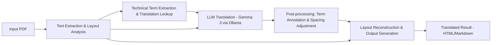

# PDF Translator

A PDF translation system that preserves layout while translating documents up to 50 pages using local LLMs (Gemma 3 via Ollama) or OpenAI API.

## Features

- **Layout Preservation**: Maintains original document structure, page breaks, and formatting
- **Local LLM Support**: Uses Gemma 3 via Ollama for privacy and cost-effectiveness
- **OCR Capability**: Handles both text and image PDFs with PaddleOCR
- **Technical Term Mining**: Automatically extracts and provides translations for technical terms
- **Multiple Output Formats**: Generates HTML or Markdown with preserved layout
- **Term Annotation**: Shows technical terms as "訳語（原語）" on first occurrence
- **Free & Open Source**: Prioritizes free tools with OpenAI as optional fallback

## Architecture



## Requirements

- Python 3.11+
- UV package manager (recommended) or pip
- Ollama (for local LLM) or OpenAI API key

## Installation

### Using UV (Recommended)

```bash
# Install dependencies
make install          # Production dependencies only
make dev-install      # All dependencies including dev tools
```

### Manual Installation

```bash
# Clone the repository
git clone <repository-url>
cd pdf-translator

# Install dependencies
pip install -e .
```

## Setup

### 1. Install Ollama and Models

```bash
# Start Ollama server and install Gemma 3
make run-ollama       # Starts server and ensures gemma3:12b is available

# Or manually:
ollama serve
ollama pull gemma3:12b
```

### 2. Configuration

Copy and modify the configuration file:

```bash
cp config/config.yml config/config.yml.local
```

Key configuration options:

```yaml
translator:
  engine: ollama              # ollama / openai
  model: gemma3:12b-it-q8_0   # Ollama model name
  openai_model: gpt-3.5-turbo # For engine=openai

source_language: auto
target_language: ja
preserve_format: true
include_source_term: true

output_format: markdown   # markdown / html
max_pages: 50
```

### 3. For OpenAI API (Optional)

Set your API key:

```bash
export OPENAI_API_KEY="your-api-key-here"
```

## Usage

### Command Line

```bash
# Basic usage
pdf-translator input.pdf

# Specify output format
pdf-translator input.pdf --format html

# Use OpenAI instead of local LLM
pdf-translator input.pdf --engine openai

# Custom output path
pdf-translator input.pdf --output translated.md
```

### Python API

```python
from src.main import PDFTranslator

translator = PDFTranslator()
result = translator.translate("input.pdf", output_format="markdown")
print(result)
```

## Module Overview

| Module | Purpose | Key Libraries |
|--------|---------|---------------|
| **extractor** | PDF text extraction & OCR | PyMuPDF, PaddleOCR |
| **layout_analyzer** | Layout detection for columns, tables, figures | LayoutLM, DiT |
| **term_miner** | Technical term extraction & translation lookup | spaCy, Wikipedia API |
| **translator** | LLM integration for translation | Ollama/OpenAI |
| **post_processor** | Source term annotation & spacing adjustment | Python (regex) |
| **renderer** | HTML/Markdown output generation | Jinja2, Markdown-it-py |

## Development

### Setup Development Environment

```bash
make dev-install      # Install all dependencies including dev tools
```

### Running Tests

```bash
make test             # Run all tests
make test-translate   # Quick test with sample PDF
```

### Code Quality

```bash
make lint             # Run linting with ruff
make format           # Format code with ruff  
make type-check       # Type checking with mypy
make check            # Run all checks (lint, type-check, test)
```

### Environment Verification

```bash
# Verify all components work correctly
./run-uv.sh run python test_setup.py
```

## Limitations

- Maximum 50 pages per PDF
- Figures and tables are preserved as-is (not translated)
- Technical terms are annotated in Japanese style: "訳語（原語）"
- Page breaks must be preserved (no text crossing pages)

## Contributing

1. Fork the repository
2. Create a feature branch
3. Make your changes
4. Run tests and code quality checks: `make check`
5. Submit a pull request

## Technology Stack

- **Local LLM**: Gemma 3 via Ollama (OpenAI API compatible)
- **PDF Processing**: PyMuPDF for text extraction
- **OCR**: PaddleOCR for image-based PDFs
- **Layout Analysis**: LayoutLM/DiT for document structure
- **NLP**: spaCy for Japanese text processing
- **Rendering**: Jinja2 templates with Markdown-it-py

## License

MIT License - see [LICENSE](LICENSE) file for details.

## Support

For issues and questions, please use the [GitHub Issues](../../issues) page.